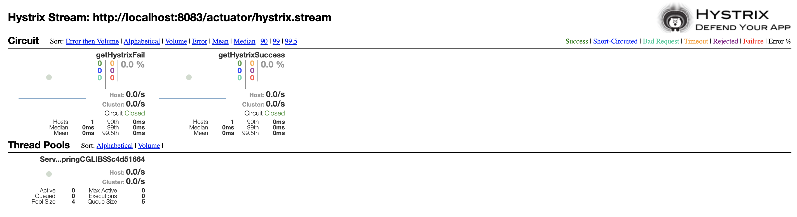

## Spring Cloud Circuit Breaker ##
*Spring Cloud Netflix Hystrix* – the fault tolerance library. 

Hystrix is watching methods for failing calls to related services. 
If there is such a failure, it will open the circuit and forward the call to a fallback method. 

# Dependencies
Add *spring-cloud-starter-netflix-hystrix*
```xml
<dependencies>
    <dependency>
        <groupId>org.springframework.cloud</groupId>
        <artifactId>spring-cloud-starter-netflix-hystrix</artifactId>
    </dependency>
</dependencies>
```
And *spring-cloud-dependencies*
```xml
<dependencyManagement>
    <dependencies>
        <dependency>
            <groupId>org.springframework.cloud</groupId>
            <artifactId>spring-cloud-dependencies</artifactId>
            <version>${spring-cloud.version}</version>
            <type>pom</type>
            <scope>import</scope>
        </dependency>
    </dependencies>
</dependencyManagement>
```

# Code
Just a configuration class.

Add *@EnableCircuitBreaker*
```java
@EnableCircuitBreaker
@SpringBootApplication
public class ServerApplication {
	public static void main(String[] args) {
		SpringApplication.run(ServerApplication.class, args);
	}
}
```
And also create 2 REST endpoints for testing hystrix command.
```java
@ResponseBody
@GetMapping("/hystrix/success")
@HystrixCommand(fallbackMethod = "successCallback")
public String getHystrixSuccess() {
    return "Success";
}

@ResponseBody
@GetMapping("/hystrix/fail")
@HystrixCommand(fallbackMethod = "failFallback")
public String getHystrixFail() {
    throw new RuntimeException();
}

public String failFallback() {
    return "Fail fallback";
}

public String successCallback() {
    return "Success callback";
}
```

# Config
No need a specific configuration.


# Testing
1. Browser at: http://localhost:8083/hystrix/success
2. Browser at: http://localhost:8083/hystrix/fail

# More
To enable Hystrix Dashboard for monitoring.

Add a dependency
```xml
<dependency>
    <groupId>org.springframework.cloud</groupId>
    <artifactId>spring-cloud-starter-netflix-hystrix-dashboard</artifactId>
</dependency>
<dependency>
    <groupId>org.springframework.boot</groupId>
    <artifactId>spring-boot-starter-actuator</artifactId>
</dependency>
```

And annotation
```java
@EnableHystrixDashboard
```
And expose *hystrix.stream* for actuator
```yaml
management:
  endpoints:
    web:
      exposure:
        include: hystrix.stream
```
And the result at: http://localhost:8083/hystrix
