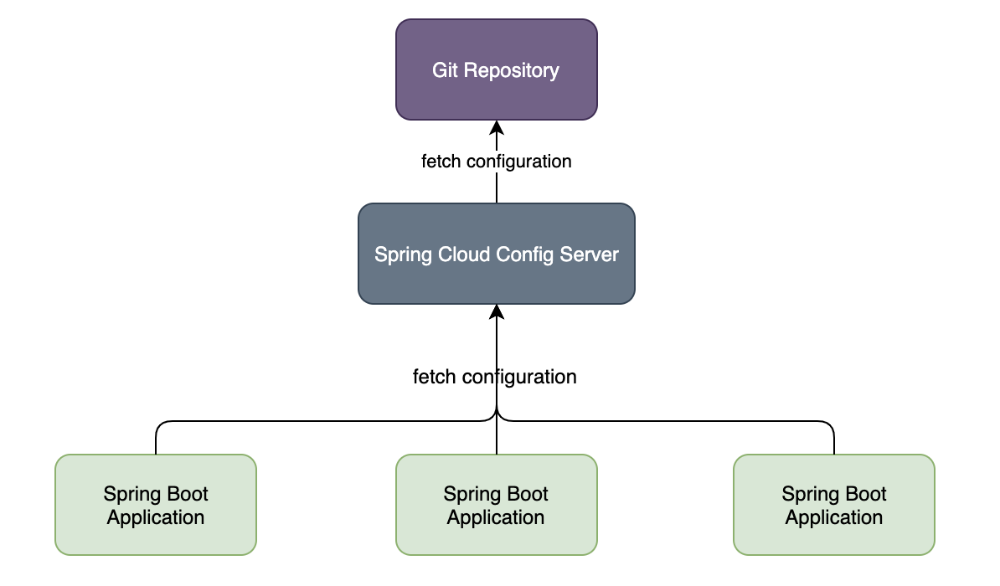

Spring Cloud Config is Spring's client/server approach for storing and serving distributed configurations across multiple applications and environments.

This configuration store is ideally versioned under Git version control and can be modified at application runtime. While it fits very well in Spring applications using all the supported configuration file formats together with constructs like Environment, PropertySource or @Value, it can be used in any environment running any programming language.

