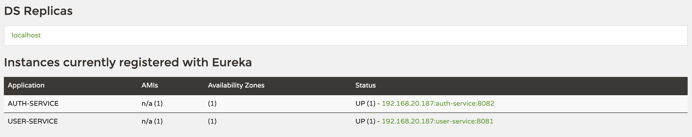

The **Eureka Client** will registers with **Eureka Server**, it provides meta-data about itself — such as host, port, health indicator URL, home page, and other details. Eureka Server receives heartbeat messages from each instance belonging to a service. If the heartbeat fails over a configurable timetable, the instance is normally removed from the registry.

In this example, I will create 2 eureka client services: user service and authentication service.
Both of them register to Eureka Server. When a user want to authentication, authentication service will make a REST request to user service.

# Dependencies
Add *spring-cloud-starter-netflix-eureka-client*
```xml
<dependencies>
    <dependency>
        <groupId>org.springframework.cloud</groupId>
        <artifactId>spring-cloud-starter-netflix-eureka-client</artifactId>
    </dependency>
</dependencies>
```
And *spring-cloud-dependencies*
```xml
<dependencyManagement>
    <dependencies>
        <dependency>
            <groupId>org.springframework.cloud</groupId>
            <artifactId>spring-cloud-dependencies</artifactId>
            <version>${spring-cloud.version}</version>
            <type>pom</type>
            <scope>import</scope>
        </dependency>
    </dependencies>
</dependencyManagement>
```

# Code
The main part of the application is a config class.

Add *@EnableDiscoveryClient*
```java
@EnableDiscoveryClient
@SpringBootApplication
public class ServerApplication {
	public static void main(String[] args) {
		SpringApplication.run(ServerApplication.class, args);
	}
}
```
# Config
Config server port, require service name and eureka server info

```properties
server.port=8080
spring.application.name=service-name
eureka.client.serviceUrl.defaultZone=http://localhost:8761/eureka
eureka.instance.preferIpAddress=true
```

# Testing
1. Run eureka server
2. Run user service
3. Run auth service
4. Browser at: http://localhost:8761

5. Browser at: http://localhost:8082/auth?username=hoangdieuctu