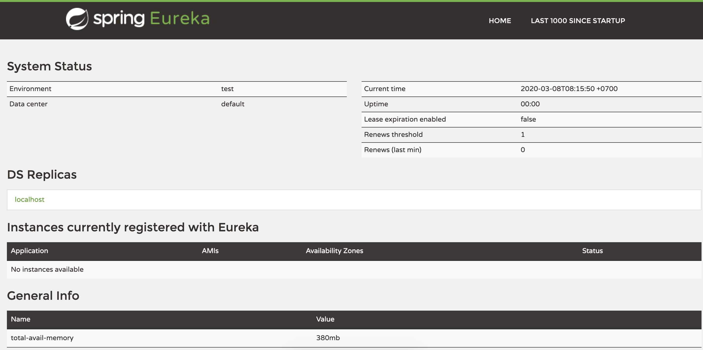

The **Eureka Server** is a standalone application and is responsible for: managing a registry of Service Instances, provide means to register, de-register and query Instances with the registry, registry propagation to other Eureka Instances (Servers or Clients).

# Dependencies
Add *spring-cloud-starter-netflix-eureka-server*
```xml
<dependencies>
    <dependency>
        <groupId>org.springframework.cloud</groupId>
        <artifactId>spring-cloud-starter-netflix-eureka-server</artifactId>
    </dependency>
</dependencies>
```
And *spring-cloud-dependencies*
```xml
<dependencyManagement>
    <dependencies>
        <dependency>
            <groupId>org.springframework.cloud</groupId>
            <artifactId>spring-cloud-dependencies</artifactId>
            <version>${spring-cloud.version}</version>
            <type>pom</type>
            <scope>import</scope>
        </dependency>
    </dependencies>
</dependencyManagement>
```

# Code
The main part of the application is a config class.

Add *@EnableEurekaServer*
```java
@EnableEurekaServer
@SpringBootApplication
public class ServerApplication {
	public static void main(String[] args) {
		SpringApplication.run(ServerApplication.class, args);
	}
}
```
# Config
Config server port

```properties
server.port=8761
```
When the registry starts, it will complain that there are no replica nodes to which the registry can connect. In a production environment, you will want more than one instance of the registry. For our simple purposes, however, it suffices to disable the relevant logging.

By default, the registry also tries to register itself, so you need to disable that behavior as well.
```properties
eureka.client.register-with-eureka=false
eureka.client.fetch-registry=false
```

# Testing
1. Start Eureka Server
2. Browser at: http://localhost:8761
