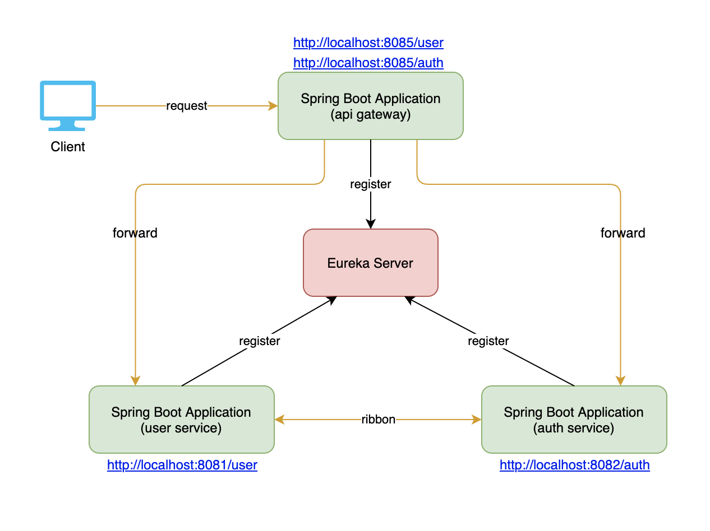
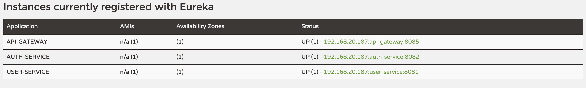

## Spring Cloud Gateway ##
Spring Cloud Gateway is an API Gateway on top of Spring MVC. 
This aims to provide a simple, yet effective way to route to APIs and provide cross cutting concerns to them such as: security, monitoring/metrics, and resiliency.


This will reuse 2 services on Spring Cloud Discovery project.
Basic idea that all the services (auth service, user service, api gateway) will register to **eureka server**.
When a request coming, gateway will forward to a specific service.

# Dependencies
This is just a **eureka client** application.
Add *spring-cloud-starter-gateway* and *spring-cloud-starter-netflix-eureka-client*
```xml
<dependencies>
    <dependency>
        <groupId>org.springframework.cloud</groupId>
        <artifactId>spring-cloud-starter-netflix-eureka-client</artifactId>
    </dependency>
    <dependency>
        <groupId>org.springframework.cloud</groupId>
        <artifactId>spring-cloud-starter-gateway</artifactId>
    </dependency>
</dependencies>
```
And *spring-cloud-dependencies*
```xml
<dependencyManagement>
    <dependencies>
        <dependency>
            <groupId>org.springframework.cloud</groupId>
            <artifactId>spring-cloud-dependencies</artifactId>
            <version>${spring-cloud.version}</version>
            <type>pom</type>
            <scope>import</scope>
        </dependency>
    </dependencies>
</dependencyManagement>
```

# Code
Just a configuration class.

Add *@EnableDiscoveryClient*
```java
@EnableDiscoveryClient
@SpringBootApplication
public class ServerApplication {
	public static void main(String[] args) {
		SpringApplication.run(ServerApplication.class, args);
	}
}
```
# Config
The configuration is really important. It's config the services mapping based on uri and eureka client.

```yaml
server:
  port: 8085

eureka:
  client:
    serviceUrl:
      defaultZone: http://localhost:8761/eureka
  instance:
    preferIpAddress: true

spring:
  application:
    name: api-gateway
  cloud:
    gateway:
      discovery:
        locator:
          enabled: true
          lower-case-service-id: true
      routes:
        - id: auth-service
          uri: lb://auth-service
          predicates:
            - Path=/auth/**
        - id: user-service
          uri: lb://user-service
          predicates:
            - Path=/user/**
```
The configuration show that, the path with prefix */auth/* will be forwarded to **auth service** 
and */user/* will be forward to **user service**.


# Testing
1. Start Eureka Server
2. Start Auth Service
3. Start User Service
4. Start API Gateway

5. Browser at: http://localhost:8085/auth?username=hoangdieuctu
6. Browser at: http://localhost:8085/user?username=hoangdieuctu

# More
Actually, in the real project we can do more things than just route the requests to the services.

1. Token validation: this is a good place to verify the jwt token. Just expose only gateway to outside so that easy to secure the entire system.

2. Metrics and monitoring: all the requests will be moved over this service, so that we can keep track the metrics and easy to have a custom filter that can store the request (host, header, body) and response to somewhere (Elastic Search).

3. Fail safe: easy to apply **Circuit Breaker** to protect your services with Hystrix.
